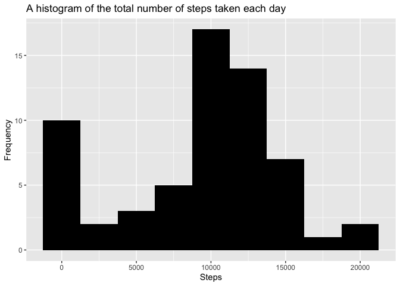
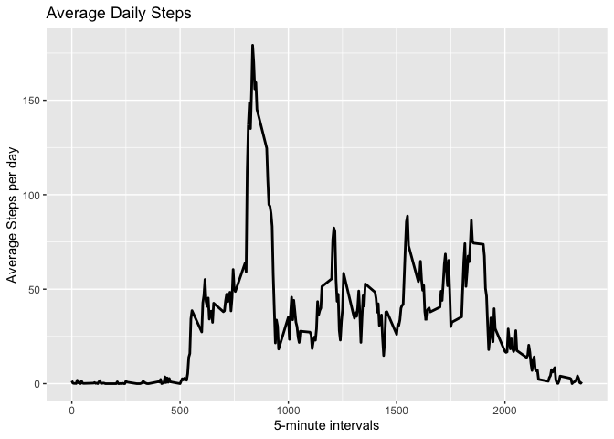
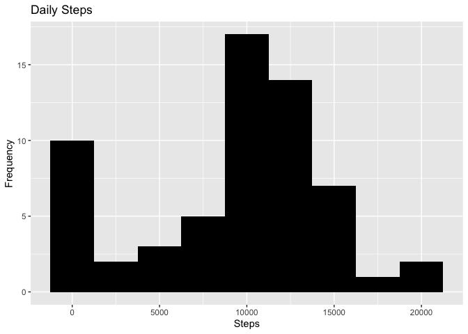
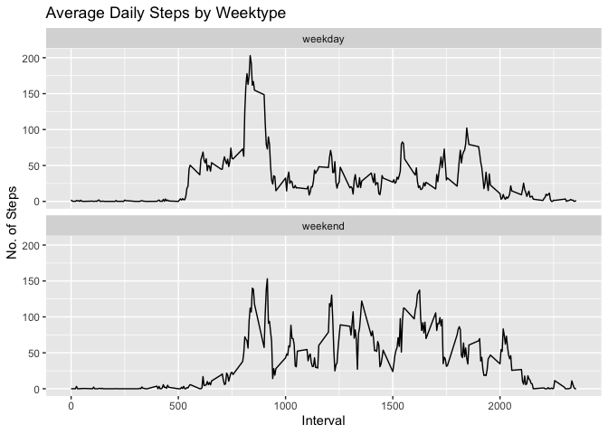

## Loading and preprocessing the data


```r
library("data.table")
library(ggplot2)
activity <- data.table::fread(input = "activity.csv")
```


## What is mean total number of steps taken per day?


```r
Total_Steps <- activity[, c(lapply(.SD, sum, na.rm = FALSE)), .SDcols = c("steps"), by = .(date)] 
head(Total_Steps, 10)
```

```
##           date steps
##  1: 2012-10-01     0
##  2: 2012-10-02   126
##  3: 2012-10-03 11352
##  4: 2012-10-04 12116
##  5: 2012-10-05 13294
##  6: 2012-10-06 15420
##  7: 2012-10-07 11015
##  8: 2012-10-08     0
##  9: 2012-10-09 12811
## 10: 2012-10-10  9900
```

A histogram of the total number of steps taken each day. 


```r
ggplot(Total_Steps, aes(x = steps)) +
    geom_histogram(fill = "black", binwidth = 2500) +
    labs(title = "A histogram of the total number of steps taken each day", x = "Steps", y = "Frequency")
```

<!-- -->

The mean and median of the total number of steps taken per day


```r
Total_Steps[, .(Mean_Steps = mean(steps, na.rm = TRUE), Median_Steps = median(steps, na.rm = TRUE))]
```

```
##    Mean_Steps Median_Steps
## 1:    9354.23        10395
```

## What is the average daily activity pattern?

Make a time series plot (i.e. 𝚝𝚢𝚙𝚎 = "𝚕") of the 5-minute interval (x-axis) and the average number of steps taken, averaged across all days (y-axis)


```r
IntervalDT <- activity[, c(lapply(.SD, mean, na.rm = TRUE)), .SDcols = c("steps"), by = .(interval)] 
ggplot(IntervalDT, aes(x = interval , y = steps)) + geom_line(color="black", size=1) + labs(title = "Average Daily Steps", x = "5-minute intervals", y = "Average Steps per day")
```

<!-- -->

Which 5-minute interval, on average across all the days in the dataset, contains the maximum number of steps?


```r
IntervalDT[steps == max(steps), .(max_interval = interval)]
```

```
##    max_interval
## 1:          835
```


## Imputing missing values

The total number of missing values in the dataset (i.e. the total number of rows with 𝙽𝙰s)


```r
activity[is.na(steps), .N ]
```

```
## [1] 0
```

Strategy for filling in all of the missing values in the dataset


```r
# Filling in missing values with median of dataset. 
activity[is.na(steps), "steps"] <- activity[, c(lapply(.SD, median, na.rm = TRUE)), .SDcols = c("steps")]
```

A new dataset that is equal to the original dataset but with the missing data filled in


```r
data.table::fwrite(x = activity, file = "new_activity.csv", quote = FALSE)
```

A histogram of the total number of steps taken each day and calculate and report the mean and median total number of steps taken per day. Do these values differ from the estimates from the first part of the assignment? What is the impact of imputing missing data on the estimates of the total daily number of steps?


```r
# total number of steps taken per day
Total_Steps <- activity[, c(lapply(.SD, sum)), .SDcols = c("steps"), by = .(date)] 
# mean and median total number of steps taken per day
Total_Steps[, .(Mean_Steps = mean(steps), Median_Steps = median(steps))]
```

```
##    Mean_Steps Median_Steps
## 1:    9354.23        10395
```

```r
ggplot(Total_Steps, aes(x = steps)) + geom_histogram(fill = "black", binwidth = 2500) + labs(title = "Daily Steps", x = "Steps", y = "Frequency")
```

<!-- -->

Type of Estimate | Mean_Steps | Median_Steps
--- | --- | ---
First Part (with na) | 10765 | 10765
Second Part (fillin in na with median) | 9354.23 | 10395

## Are there differences in activity patterns between weekdays and weekends?

A new factor variable in the dataset with two levels – “weekday” and “weekend” indicating whether a given date is a weekday or weekend day.


```r
# Just recreating activity from scratch then making the new factor variable. (No need to, just want to be clear on what the entire process is.) 
activity <- data.table::fread(input = "activity.csv")
activity[, date := as.POSIXct(date, format = "%Y-%m-%d")]
activity[, `Day of Week`:= weekdays(x = date)]
activity[grepl(pattern = "Monday|Tuesday|Wednesday|Thursday|Friday", x = `Day of Week`), "weekday or weekend"] <- "weekday"
activity[grepl(pattern = "Saturday|Sunday", x = `Day of Week`), "weekday or weekend"] <- "weekend"
activity[, `weekday or weekend` := as.factor(`weekday or weekend`)]
head(activity, 10)
```

```
##     steps       date interval Day of Week weekday or weekend
##  1:     0 2012-10-01        0      Monday            weekday
##  2:     0 2012-10-01        5      Monday            weekday
##  3:     0 2012-10-01       10      Monday            weekday
##  4:     0 2012-10-01       15      Monday            weekday
##  5:     0 2012-10-01       20      Monday            weekday
##  6:     0 2012-10-01       25      Monday            weekday
##  7:     0 2012-10-01       30      Monday            weekday
##  8:     0 2012-10-01       35      Monday            weekday
##  9:     0 2012-10-01       40      Monday            weekday
## 10:     0 2012-10-01       45      Monday            weekday
```

A panel plot containing a time series plot (i.e. 𝚝𝚢𝚙𝚎 = "𝚕") of the 5-minute interval (x-axis) and the average number of steps taken, averaged across all weekday days or weekend days (y-axis).


```r
activity[is.na(steps), "steps"] <- activity[, c(lapply(.SD, median, na.rm = TRUE)), .SDcols = c("steps")]
IntervalDT <- activity[, c(lapply(.SD, mean, na.rm = TRUE)), .SDcols = c("steps"), by = .(interval, `weekday or weekend`)] 
ggplot(IntervalDT , aes(x = interval , y = steps)) + geom_line() + labs(title = "Average Daily Steps by Weektype", x = "Interval", y = "No. of Steps") + facet_wrap(~`weekday or weekend` , ncol = 1, nrow=2)
```

<!-- -->
